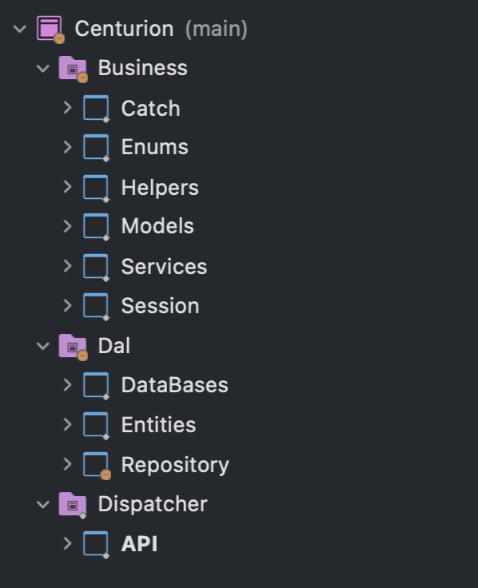

# Centurion .Net Core Web API Template

This template allows you to obtain a **Web API** project in **.Net** with a monolotic architecture based on **CSR (Controller, Services and Repositories)**. This architecture is organized in **SRP (Single responsibility for each project)**

## Solutions Layers
- Dispatcher (API's Layer)
- business (business logic Layer)
- Dal (Data Acces Layer)

### Dispatcher Layer
This layer allow have your API with all controllers and resources needed for well work

### business Layer
This layer allows to hosts all business logic for your application. This layout contains the next projects:

- Catch
- Enums
- Helpers
- Models
- Services
- Session

### Dal Layer
This layer allows contain your repositories and entities needed for your DataBaseContext